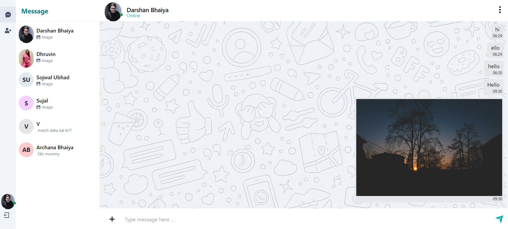

# MERN Chat App



## Overview

This project is a real-time chat application built using the MERN stack (MongoDB, Express.js, React.js, Node.js), along with Socket.io for real-time communication, Redux-Toolkit for state management, and Tailwind CSS for styling. The app allows users to chat in real-time and share images and videos.

## Features

- Real-time messaging
- Image and video sharing
- Responsive design using Tailwind CSS
- State management with Redux-Toolkit

## Installation

1. Clone the repository:

2. Change the environment variables according to your MongoDB URL and Cloudinary cloud name in the server and client respectively.

### Server Setup

3. Navigate to the server directory and install dependencies:
   ```bash
   cd server
   npm install
   ```

4. Run the server:
   ```bash
   npm run dev
   ```

### Client Setup

5. Navigate to the client directory and install dependencies:
   ```bash
   cd client
   npm install
   ```

6. Run the client:
   ```bash
   npm start
   ```

## Usage

Once the server and client are running, open your browser and navigate to `http://localhost:3000` to start using the chat application.

## Technologies Used

- **MongoDB**: Database for storing user and chat data
- **Express.js**: Server framework
- **React.js**: Front-end framework
- **Node.js**: JavaScript runtime for the server
- **Socket.io**: Real-time communication library
- **Redux-Toolkit**: State management
- **Tailwind CSS**: Utility-first CSS framework

## Contributing

Contributions are welcome! Please fork the repository and submit a pull request for any changes you would like to make.


